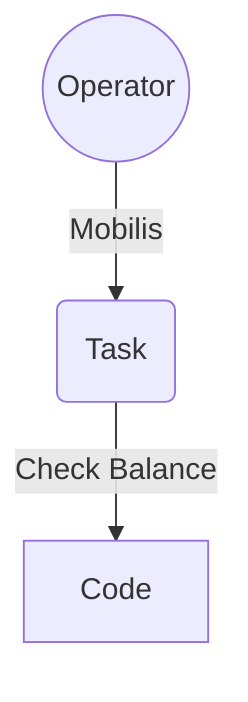
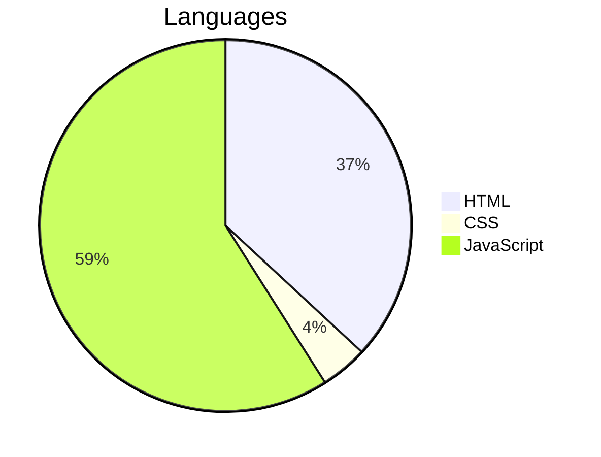

___
```
  ____ _____
 |  _ \__  /
 | | | |/ / 
 | |_| / /_ 
 |____/____|
```

# DZ SIM Codes
DZ SIM Codes

[DZ](https://haithamaouati.github.io/DZ-SIM-Codes) — This web application gives you a set of **codes** with descriptions for the three mobile operators in **Algeria**: Mobilis, Ooredoo and Djezzy.

## Table of Contents
- [Demo](#demo)
- [Flowchart](#flowchart)
- [Languages](#languages)
- [Author](#author)
- [License](#license)

## Demo
Version: **1.0**
[https://haithamaouati.github.io/DZ-SIM-Codes](https://haithamaouati.github.io/DZ-SIM-Codes)

## Flowchart



## Languages


## Author
Made with :heart: by **Haitham Aouati**

## License
This repository is under [Unlicense License](https://github.com/haithamaouati/DZ-SIM-Codes/blob/main/LICENSE).

([Table of Contents](#table-of-contents))
