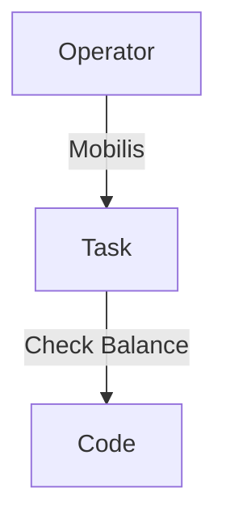

___
```
  ____ ___ __  __    ____          _      
 / ___|_ _|  \/  |  / ___|___   __| | ___ 
 \___ \| || |\/| | | |   / _ \ / _` |/ _ \
  ___) | || |  | | | |__| (_) | (_| |  __/
 |____/___|_|  |_|  \____\___/ \__,_|\___|
```

# Algerian SIM Codes
Algerian SIM Codes

[Algerian SIM Codes](https://haithamaouati.github.io/Algerian-SIM-Codes/) is a free **Converter** arabic text to a format compatible with designing software.

## Table of Contents
- [Demo](#demo)
- [Reverse](#reverse)
- [Author](#author)
- [License](#license)

## Demo
Version: **1.0**
[https://haithamaouati.github.io/Algerian-SIM-Codes](https://haithamaouati.github.io/Algerian-SIM-Codes)

**Flowchart**



## Author
Made with :heart: by **Haitham Aouati**

## License
This repository is under [Unlicense License](https://github.com/haithamaouati/Algerian-SIM-Codes/blob/main/LICENSE).

([Table of Contents](#table-of-contents))
